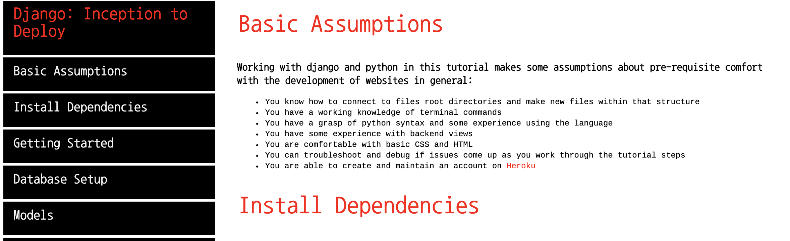
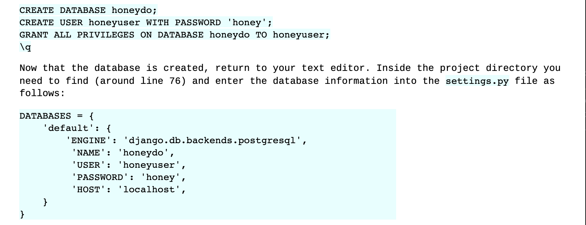
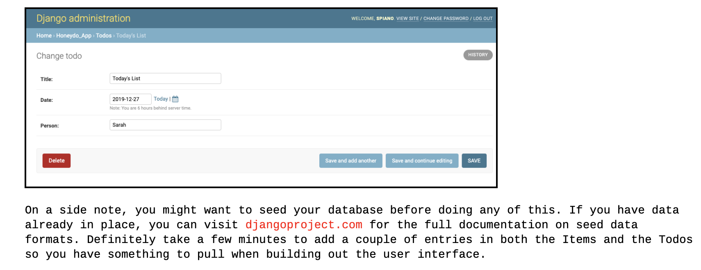

# djangoTutorial


A tutorial from inception through deployment of a fully developed back end using django and python.

## This repo is part of a series of tutorials, and here are the common features for all my tutorials

### Navigation is set to the side with the clickable links moving you down the page through the tutorial

 

### Code snippets are highlighted in blue for easy copy/paste

code example

 

typical presentation of code in README.md

```python
def item_delete(request, pk):
    item = Item.objects.get(pk=pk)
    parent_id = item.todo.pk
    item.delete()
    return redirect('todo_detail', pk = parent_id)
```
### Links to supporting documents are in red within the paragraph text



## Use this checklist as a quick reference for Django Build sequencial steps 

All tutorials are built with **HTML** and **CSS**

Please submit bugs and problems via the *issues* tab in this repo and feel free to browse other tutorials and content
 on my [website](https://spiano.dev).
